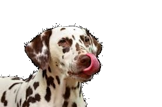
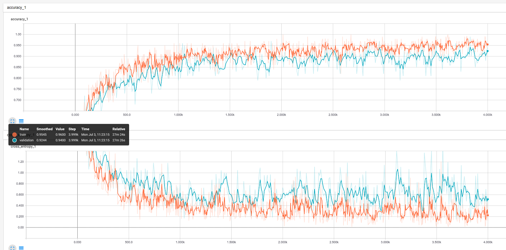
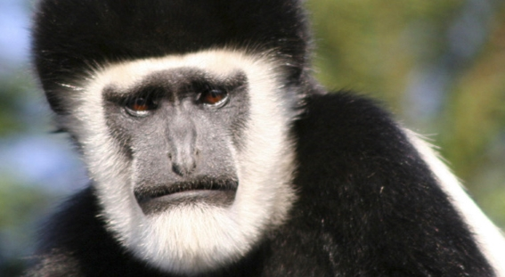
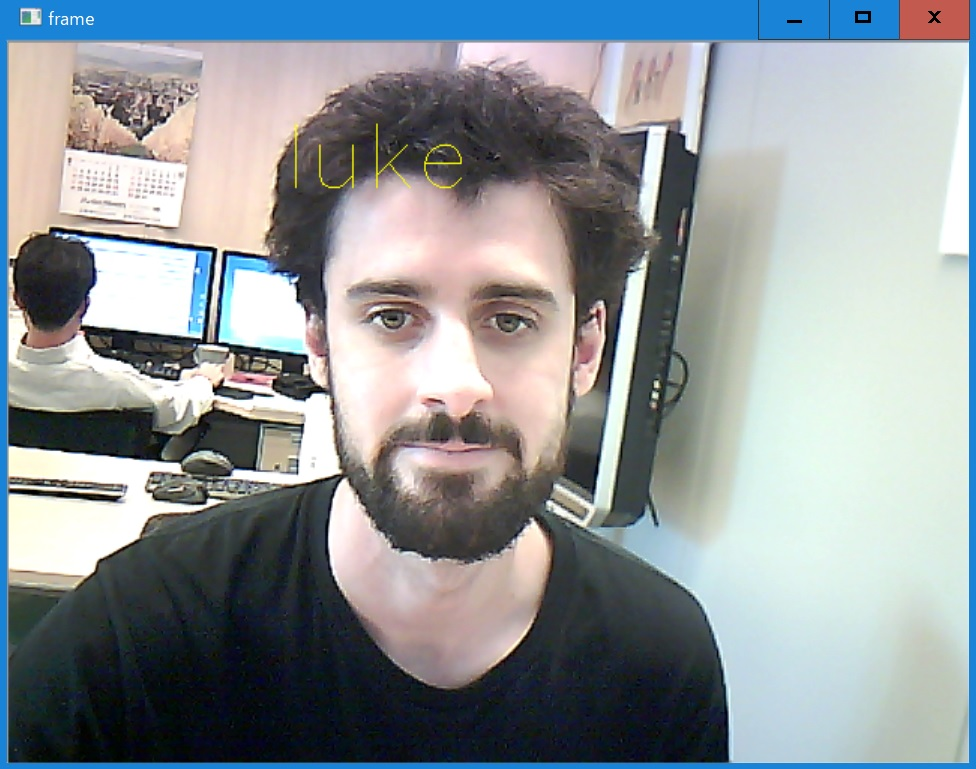
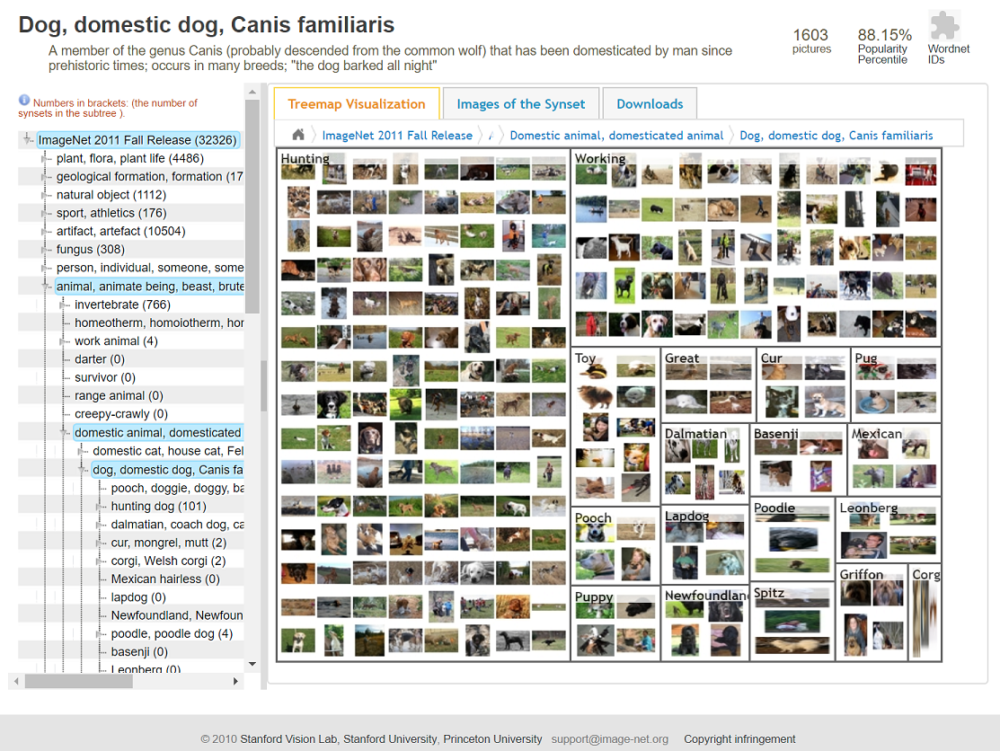
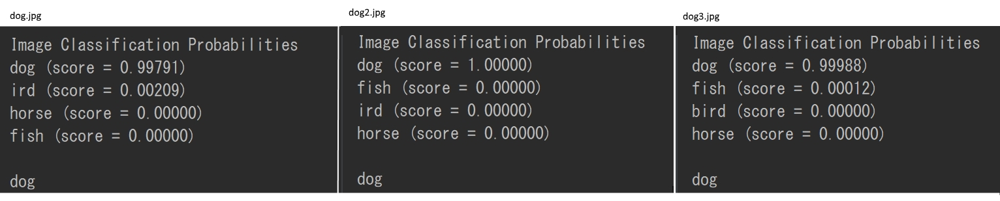
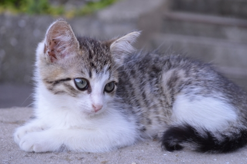

# Introduction

1. Train using tensorflow to do facial recognition.
2. Retrain a pre built graph to recognise new things.

# TENSORFLOW INSTALLATION

---
## Windows

Windowsの場合、Python3.5が必要である。Python2.7は使えないことです。
1. Python 3.5 (it is best not to install in program files)
  https://www.python.org/downloads/release/python-354/
  Append the install directory and /Scripts/ directory to the PATH.

2. Microsoft Visual C++ 2015 Redistributable Update 3 (x64 version)
  https://www.microsoft.com/en-us/download/details.aspx?id=53587
    This gives you an important DLL, you can check if you have it.
    ```
    >where msvcp140.dll
     C:\Windows\System32\msvcp140.dll
    ```
3. CUDA 8. Cuda is only required if you own a Nvidia GPU with Cuda support, and wont to take advantage of CUDA.
CUDA will make training and classification much faster compared to using the CPU.
  https://developer.nvidia.com/cuda-downloads  
  + Windows PATHとCUDAの“Bin”DIRをつなぐ
    + Copy the CUDA install directory (default is
    "C:\Program Files\NVIDIA GPU Computing Toolkit\CUDA\v8.0")
    and append it to the Windows Path
4. cuDNN v5.1  
  https://developer.nvidia.com/cudnn		
  * cuDNNの.zipの中からファイルをコピーして、CUDAのDIRに入れてください。
&nbsp;&nbsp;"cuda\bin\cudnn64_5.dll" 　	→　"～\NVIDIA GPU Computing Toolkit\CUDA\v8.0\bin\"  
&nbsp;&nbsp;"cuda\include\cudnn.h" 　	→　"～\NVIDIA GPU Computing Toolkit\CUDA\v8.0\include\"  
&nbsp;&nbsp;"cuda\lib\x64\cudnn.lib" 　	→　"～\NVIDIA GPU Computing Toolkit\CUDA\v8.0\lib\x64\"  
5. Install Tensorflow for python
  Open CMD window  
  WITH CUDA, run the following command.
  >  pip3 install --upgrade tensorflow-gpu  

WITHOUT CUDA, run the following command.

  >  pip3 install --upgrade tensorflow
6. Verify correct installation. Open a python shell and try to use tensorflow.

Tensorflow "HelloWorld"  

```python
import tensorflow as tf
hello = tf.constant('Hello, TensorFlow!')
sess = tf.Session()
print(sess.run(hello))
```

---
## Linux
todo

----
## MAC
todo

# DATA
## The Importance of Good Data
As we will be making a Convoluted Nerual Network for image recognition and classification, our data will be in the form of images.
 But in order to get good results, we need many images (the more the better generally) as to cover a wide range of cases.
 The more "vague" the images are, the more capable the system will be of capturing the key points of what makes the image what it is.

For example, training an animal recogniser with images like this for the dog class, such as,
  
")
  
would be bad for a few reasons. Most obviously, it would fail to recognise this dog,
  

  
Because the training data dogs all have similar pure white coats, the AI model will not understand that dogs can different have markings.
 That dogs are not always pure white.
 In the real world dogs have many different kinds of markings.
 Therefore the training data needs to be vague in that area, so the AI learns that dogs can be many different colours and markings.

However, some thing will remain static, those are the same things that we as humans recognise as "dog". The paws, ears, snout etc.

Another important thing is the angle of the dogs in the training data.
 In the bad example, they are all facing the same direction.
 Good data should try to include many different angles so that a dog can be recognised, regardless of its facing.

## Obtaining Data

A lot of data is required to train a CNN, and depending on the class of object to classify, this can be hard to obtain.
 Continuing the example of dogs, how can be get hundreds or thousands of pictures of dogs, with a wide range of angles, breeds, colours and backgrounds?

+ The most accurate way, but also potentially the most time-consuming is to create the data first hand, with a camera.
  + We will use this method for Example Project B.
+ Another method is by using google image search for "dog", and manually downloading the files.
 When taking this root, it is important to make sure the images have the correct usage rights.
+ A third way, is to use the website, http://www.image-net.org/.
This site is a collection of images that are tagged, so you can find a category of images with a noun keyword search.
  + We will use this method for Example Project A.

## Cleaning and Labeling Data

Data used to train a CNN must be labeled correctly.
If the computer has no way of knowing what the training data is, it cannot inform it in its learning stage.
 Instead of renaming or appropriately naming each and every of the housands or hundreds of thousands of images, we will simply place images into an appropriately named folder.
 We can then map the folder name to the images class.

---

# Training
## What is Training?
A CNN is created by feeding it many images that you have labeled appropriately.
 This is called "supervised learning", because we guide the creation by ensuring this training data is correct.

"Unsupervised training" also exists, but we will not look at it yet.

As we have told the algorithm what each image is, it can then look at these images and find common points, in the form of common convolutions.
For a dog, it will find that there are commonly things such as,
+ two triangles (the ears)
+ two circles at a set width apart (the eyes)
+ tree circles in a triangle formation (eyes and nose)
+ ...etc

These are simple examples that are good for human understanding.
 Realistically the CNN is so powerful because it may find things that we don't really appreciate, but are powerful identifiers for a computer system.

Another important step of the training process is that it essentially discards or loosens the importance of all its inferred knowledge randomly.
 This is important because it means the model is not too strict, or "over-fitted".
 A model that suffers from over-fitting will work extremely well on training/validation data, but not well on wild data.

So how does the actually learning of these features happen?
Essentially,
1. The model initially just randomly guesses features to
build a model.
2. The build model is put to the test by trying to classify images
from the "validation data" set. This data is from the supplied data-set,
so the true answer is available.
3. The algorithm then checks how accurate it was.
4. Values are tweaked in the model.
5. Step 2 and then 3 is repeated.
6. The values are again tweaked, but taking into account how the
accuracy changed. The algorithm will in this way learn the best values
for things by how the alter the accuracy of the validation stage.
7. The process repeats until the exit paramater is meet (set by
programmer). Exit parameters can be things such as,
  + Max number of Epoch
  + Change in accuracy is no longer significant between epochs
  + Accuracy doesnt get higher anymore.
  + ...etc

Fortunately, due to the Tensorflow library, we do not need to implement the algorithms.
 We can simply make the relevant calls and pass in the data as we want, making the process very simple.

Tensorflow also allows you to implement your own algorithms though, so more advances users can still use it too(as a framework).

## Validating a Trained Model with Tensorboard

Using Tensorflow makes debuging the CNN model much easier, thanks to the "Tensorboard" feature.

結果は確認仕方

トレーニングが終わってから、結果をtensorboardというアプリで確認する
べきである。

```bat
tensorboard --logdir [directory of log files]
```

http://localhost:6006

特に'Accuracy'が安定になってきたかどうかを確認ように。もし'accuracy'は
まだ増えていたら、training_stepsを上げて、繰り返す。



Cross entropy is the amount of change per epoch. Lower is better.

Accuracy is the accuracy of classifying teh validation data at each point of the model.
 Accuracy should be stable at the time of termination.
If it is still increasing, re-run with an exit param that would let it train for longer.

It is good practice to look at the tensorboard output after training a model, to see if you need a better exit param, and verify the model.

# Classifying.
Once the model is created, we can use it to classify a wild image (animage that the model never saw during creation phase).
 If the model is good, it should recognise it appropriately.

Of course the model can only recognise into the classes that it was trained for.
 So if the model was trained with the classes; dog, cat and bird, it will not classify a horse as a horse.
 Rather, as a dog or as a cat or as a bird (probably with low accuracy.)

# Summary

That is a very basic overview of the theory behind Convoluted Neural Networks.
 The key points to take away are that,
+ Data is very important, and the better and more extensive the better
the resulting model will be.
+ AI is not magic, it can only understand what it has been taught to
understand, by the data.
+ Tensorflow is a good tool to make everything easier.

Next we will make and use two models.

The first is a simple network with data taken from Imagenet.
 It will classify still images.

The second will classify a video feed in real time.
 We will create the data ourselves.

End

---
---

# Demo Project A. Real-time Face Recognition CNN
We will make a program to classify images in real time from a web-camera feed.

The classification will be faces. We will train the CNN for each person in this room, then try to recognise who is in front of the camera.

Obviosly there is no database of each of our faces, so we are going to have to create the data ourselves.

The easiest way is to simply capture and save each frame of a camera stream.

The following code will capture frames and save them to the class folder.

The following things should be done to increase accuracy,
+ Move your sitting position around during the capture.
+ Have someone change the lighting conditions periodically. Such as
by dimming or tuning on/off lights, or opening blinds.
+ Pull many different faces, and speak to someone during the capture.

However in this case we are only concerned with the face, so we also want some code to automatically crop the image to the face only.
 To do this we need to make use of another python library, namly OPENCV.

---

## Part One - Installations.

1. Ensure that Python is installed correctly. (with PATH)
```bat
python
```
You should see "python 3.5.x ~".
If not, refer to "Tensorflow Installation"

2. Ensure Tensorflow is installed correctly
  1. Start a python shell
  2. Run the following commands in a python shell to check if tensorflow is installed.

  ```python
    import tensorflow as tf
    hello = tf.constant('Hello, TensorFlow!')
    sess = tf.Session()
    print(sess.run(hello))
  ```

You should get the output like "b'Hello, TensorFlow!'".
If not, refer to "Tensorflow Installation"

### Installing OpenCV
OpenCVはPython2.7のAPIだけど下のURLでPython3で使えるバージョンがあります。
普通にPIP通にインストールしたら、Python2Verだから、下のリンクからインストールしてください。

python 3: 　http://www.lfd.uci.edu/~gohlke/pythonlibs/#opencv

```bat
pip install opencv_python-3.2.0-cp35-cp35m-win32.whl
```

verify install by opening a python shell and then trying,

```python
import cv2
```

### Installing KERAS

The modeling part of the code will also use the help of KERAS

(https://keras.io/).

KERAS is a 3rd party tool to make  writing Tensorflow code even more simple.

And so therefore we need to have KERAS installed!

Open a command window.

```bat
pip install keras
```

Then, verify it is installed correctly and using Tensorflow.

Open a command window.

```bat
python -c "from keras import backend; print(backend._BACKEND)
```

You should see "Using Tensorflow backend".

---

## Data

Next we need to write a program to capture and save frames from your webcam.
 The program also uses algorithm "HARCASCADE" to find the face and crop to only that region.
  Download and put in the project directory the "har-cascaades/" folder and contents from repo.

The reason for cropping to the face is because it will make the program independant (at least more so) of the background environment, and it will simplify the process of identifying multiple people at the same time (on the same camera feed).

(Availible in repo as "Frame_Face_Capture.py")

**This code isnt AI related, its just a simple script to get the images from the web-cam.
 In otherwords dont worry about trying to understand it if you dont want to.**

```python
import cv2
import threading
import os
import copy
import sys
import argparse
import time
import shutil

save = False


def ready_save():
    global save
    save = True


def video_feed(args):
    global save
    face_cascade = ""
    cascade_adjust = 25
    if hasattr(args, 'har'):
        face_cascade = cv2.CascadeClassifier(args.har)
        if face_cascade == "":
            raise ValueError('har cascade directory is not valid')
    cnt = 0

    # get class name and append class
    classname = "-1"
    if not os.path.exists(args.output_directory):
        classname = "0"
        os.makedirs(args.output_directory)
    else:
        with open(os.path.join(args.output_directory, "class_lookup.txt")) as text_file:
            c = list(text_file)[-1]
            classname = int(c.split(",")[0])+1
            classname = str(classname)
    with open(os.path.join(args.output_directory, "class_lookup.txt"), "a+") as text_file:
        text_file.write(classname+","+args.label+"\n")

    cap = cv2.VideoCapture(0)

    # ready first capture.
    threading.Timer(args.photo_interval, ready_save).start()
    time.sleep(2)  # web camera warm up
    # run the camera loop
    while True:
        # exit the camera loop prematurely with the q key
        if cv2.waitKey(1) & 0xFF == ord('q'):
            break
        if cv2.waitKey(1) & 0xFF == ord('p'):  # pause
            print('p')
            cv2.waitKey(-1)  # wait until press again
        screen_txt = '%s : %s / %s' % (args.label, cnt + 1, args.number_of_samples)
        # Capture frame-by-frame
        ret, frame = cap.read()
        # print status
        no_text_frame = copy.copy(frame)
        no_text_frame = cv2.cvtColor(no_text_frame, cv2.COLOR_BGR2GRAY)
        cv2.rectangle(frame, (0, 0), (720, 50), (255, 255, 255), -1)
        cv2.putText(frame, screen_txt, (25, 25), cv2.FONT_HERSHEY_SIMPLEX, 1, (0, 0, 0))
        cv2.imshow('frame', frame)
        if save:
            photo_output_directory_raw = '%s\\raw\\%s\\%s%s.jpg' % \
                                         (args.output_directory, classname, args.label, cnt)
            photo_output_directory_crop = '%s\\cropped\\%s\\%s%s.jpg' % \
                                          (args.output_directory, classname, args.label, cnt)
            if not os.path.exists(os.path.dirname(photo_output_directory_raw)):
                os.makedirs(os.path.dirname(photo_output_directory_raw))
            if not os.path.exists(os.path.dirname(photo_output_directory_crop)):
                os.makedirs(os.path.dirname(photo_output_directory_crop))

            # CROPPED
            # detect object (as per input har-cascade)
            faces = face_cascade.detectMultiScale(frame, 1.3, 5)
            # failed to detect a face. Save is still true, so next iteration will try again.
            if len(faces) < 1:
                continue
            (x, y, w, h) = faces[0]
            # stock
            # roi = no_text_frame[y:y + h, x:x + w]
            # a little further cropping goes a long way
            roi_with_margins = no_text_frame[(y - cascade_adjust): y + (h + cascade_adjust),
                                             (x - cascade_adjust): x + (w + cascade_adjust)]
            cv2.imwrite(photo_output_directory_crop, roi_with_margins)
            print(photo_output_directory_crop)

            # RAW
            cv2.imwrite(photo_output_directory_raw, no_text_frame)
            print(photo_output_directory_raw)

            save = False
            cnt = cnt + 1
            # when all samples are taken, move to the next label and start from the first sample
            if cnt == args.number_of_samples:
                print("    Fin")
                break
            else:
                # schedule the next photo shoot
                threading.Timer(args.photo_interval, ready_save).start()
    cap.release()
    cv2.destroyAllWindows()
    shutil.copyfile(os.path.join(args.output_directory, "class_lookup.txt"),
                    os.path.join(args.output_directory, "cropped", "class_lookup.txt"))
    shutil.copyfile(os.path.join(args.output_directory, "class_lookup.txt"),
                    os.path.join(args.output_directory, "raw", "class_lookup.txt"))
    return


def parse_arguments(argv):
    parser = argparse.ArgumentParser()
    parser.add_argument('output_directory', type=str, help='Directory to save captured photos.')
    parser.add_argument('label', type=str, help='The class name, in other words what are you taking photo off.')
    parser.add_argument('--har', type=str, help='the har-classifer to use for auto cropping', default=
                        "har-cascaades/haarcascade_frontalface_default.xml")
    parser.add_argument('--number_of_samples', type=int, help='number of photos per class.', default=500)
    parser.add_argument('--photo_interval', type=float, help='time between photo shoots', default=.1)
    return parser.parse_args(argv)


if __name__ == '__main__':
    video_feed(parse_arguments(sys.argv[1:]))
```

to run the code, append the parameters
1. [output directory]
2. [name of face (name of person)]
3. --number_of_samples [int] (default is 60)
4. --photo_interval [float] (default is 1 second)

eg. in a command window run,

```bat
python Frame_Face_Capture.py faces Bob --number_of_samples 500 --photo_interval 0.1
```

Run the program for a number of different people.
 (or share an archive of your faces' photos with others to build a collection of at least 4 classes).

...

...

**Now we package the Data** into one set to pass it into Tensorflow easier.

**The complete code is found in "Create_Dataset.py"**
 These chunks are not the complete code.

The Global var SHAPE is declared.
 We want all the images to be scaled down to the same constant size.

```python
SHAPE = (32, 32)  # images will re-scaled to this size.
```

After geting the directories of all the data into python, we next load the data into numpy arrays.
 Numpy is a python library that, amongst a myriad of other usefull things, can be used to store images as data.
  (Essentially as arrays of pixel intensity).

We want to ensure that each class has the same number of files, because the data will be divided later.
 Actually, the training part doesnt require that each class have the same amount of images, but ensuring so makes later steps easier and more consistant.

We are keeping a second array (data_lbls) that remembers the datas class (derived from folder name), as that information would otherwise be lost since we are no longer using the filesystem.

```python
data_imgs = []
data_lbls = []
# Load the images and labels into numpy arrays
for i in range(number_of_classes):
    for j in range(number_of_examples_per_class):
        try:
            image_location = os.path.join(
                path, folder_names[i], folder_files[i][j])
        except IndexError:
            print("this folder doesnt have enough images")
            print(folder_names[i])
            return
        image = misc.imread(image_location)
        image = misc.imresize(image, size=SHAPE, interp='bilinear', mode=None)
        data_imgs.append(image)
        data_lbls.append(folder_names[i])
```

We then change the numpy arrays to floats between 0-1 instead of 0-255 int, becasue its faster when using GPU.

```python
data_imgs = np.float32(np.array(data_imgs)/255.0)
data_lbls = np.int32(np.array(data_lbls))
```

The data needs to split into three sets to train a model.
+ Train: This is the data that the model trains over.
 It adjusts itself according the the **learning rate** based on its performance on this data.
+ Validation: This is the data that is used to get a score after a training epoch.
 It doesnt adjust itself on this data, only uses it to test current performance.
  This current performance value can alter dynamic learning rates, overfitting and early stopping functions.
+ Test: At the end, this previously unseen data acts as a final test.
 It is data the model has never interacted with, giving a more accurate final score of the model in its final form.

```python
data_imgs = np.concatenate(
    [data_imgs[i::number_of_examples_per_class]
        for i in range(number_of_examples_per_class)])
data_lbls = np.concatenate(
    [data_lbls[i::number_of_examples_per_class]
        for i in range(number_of_examples_per_class)])
dataset_size = number_of_classes * number_of_examples_per_class
# train - validation - test split is 80% - 10% - 10%
data_imgs_train = data_imgs[:(dataset_size*8)//10]
data_lbls_train = data_lbls[:(dataset_size*8)//10]

data_imgs_val = data_imgs[(dataset_size*8)//10:(dataset_size*9)//10]
data_lbls_val = data_lbls[(dataset_size*8)//10:(dataset_size*9)//10]

data_imgs_test = data_imgs[(dataset_size*9)//10:]
data_lbls_test = data_lbls[(dataset_size*9)//10:]
```

The last part is to save it all into a single file.
 This is the file we are going to pass to Tensorflow.

```python
f = open(os.path.join(dataset_name), "wb")
np.save(f, data_imgs_train)
np.save(f, data_lbls_train)
np.save(f, data_imgs_val)
np.save(f, data_lbls_val)
np.save(f, data_imgs_test)
np.save(f, data_lbls_test)
np.save(f, number_of_classes)
f.close()
```

Now, in the same directory as the images is the packed file.

## Train the model.

This is the main code that needs to be understood.
 The other bits of code until now where not really AI, so you didn't need to undestand it specifically.

This code however is best to understand specifically.

Each part is presented piecemeal, with the whole complete code found in the repository as "model.py"

The parameters are;
+ '-dataset'. This is the path and name of the data set.
+ '-output_path. The path to output the model/graph to.
+ '--minibach_size'. default is 100
+ '--max_norm'. Max-norm constraint on weights. The default is 4.
+ '--initial_adam_learning_rate'. What value to start the learning
  rate at. The default is 0.01.
+ '--maximum_number_of_epochs'. How many full iterations through
the data. A higher value is longer training time'. Default is 150.
+ '--early_stopping_patience'.
 The training will cut early if after this many epochs, there is insignificant change in accuracy.
  A higher value is a longer training time, but not neccessary better model. Default=10

First we are loading in the data from the dataset file we created.
Remeber the three datasets.(Train, validation, test).

```python
f = open(dataset_name, "rb")
X_train = np.load(f)
y_train = np.load(f)
X_val = np.load(f)
y_val = np.load(f)
X_test = np.load(f)
y_test = np.load(f)
NUMBER_OF_CLASSES = np.load(f)
f.close()
```

The next important part is converting to one-hot.
 For our data each data (each image) belongs to exactly one class. eg, Bob's face is Bob's face and no-one elses.

One-hot is a labelling system where the data has a 1 for its true class and a zero for all other classes.

It makes sense that we use one-hot in this system, because each face is exactly one persons face.

```python
# Convert labels to one-hot representation
y_train = np_utils.to_categorical(y_train, NUMBER_OF_CLASSES)
y_val = np_utils.to_categorical(y_val, NUMBER_OF_CLASSES)
y_test = np_utils.to_categorical(y_test, NUMBER_OF_CLASSES)
```

Now we get into the real AI/ Tensorflow code.
 This code is using the help of KERAS (https://keras.io/).
  KERAS is a 3rd party tool to make writing Tensorflow code even more simple.

### In Depth look at the CNN Code

1. The first thing we need to do is start building the model.
 We can use Keras to create a framework.
  Here we are using 'Sequential()'.
  A sequential model is a linear stack of layers that build a CNN.

2. We add these layers also in the form on KERAS classes.
 As this is a CNN, we add 'Convultion2D' layers.

For more details on the KERAS parts, look at the KERAS documentation

https://faroit.github.io/keras-docs/1.2.2/layers/convolutional/#convolution2d

3. We apply the activation, which is PRelu.
 Its a variant of Relu.
 Relu essentially just turns off (sets to 0) all neurons that are <0

4. The dropout is the amount of neurons that are discarded.
 The reason we do this is to avoid overfitting to the data.

```python
depth = 30
model = Sequential()
model.add(Convolution2D(
    depth, 5, 5, border_mode='same',
    W_constraint=maxnorm(max_norm),
    init='he_normal',
    input_shape=(SAMPLE_SHAPE[0], SAMPLE_SHAPE[1], SAMPLE_SHAPE[2])))
model.add(BatchNormalization())
model.add(PReLU())
model.add(MaxPooling2D(pool_size=(2, 2), dim_ordering="th"))
model.add(Dropout(0.1))
```

5. This code is repeated a few times.
 Each layer feeds into the next with double the amount of filters (depth*2)

6. We finally fully connect the CNN by flattening it and then add a final Dense layer.
 This layer contains the number of classes, thus we can map a sequence to any 1 class.

```python
adam = Adam(lr=initial_adam_learning_rate)
model.compile(
    loss='categorical_crossentropy', optimizer=adam, metrics=['accuracy'])
```

7. We compile the model with the 'adam' optimizer.
 An optimizer is used to change the learning rate according to the change in some value.
 Here we have set it to change according to the 'categorical_crossentropy'.

8. Finally we call the model.fit() function in order to train the model.

The final output is the 3 files;
+ 'model_weights.h5'.
+ 'model_Arcitecture.json'.
+ 'class_lookup.txt'. Its just a translation from numbers to meaningfull
names.

----

That is how the image classification model is built(with the help of Tensorflow and TERAS)!

## Classifying with Our Model

Finally, we can use the model to classify.
 But first we need some images to classify.

1. Run the 'Frame_Face_Capture.py' program again to make some more face
photos.
2. Get some from the 'RAW' directory (non-cropped), and put them in a
folder, such as 'Classify_faces'. append '_raw' to the filename.
3. Do the same with photos from the 'cropped' directory. (appending
'_cropped'.

Now lets classify them.
 The complete classify code is in the repo as "classify_model.py"

First we load the model we created before with model.py.
 KERAS has some handy classes that make this easy.

```python
f = open(os.path.join(model_path, 'model_architecture.json'), 'r')
model = model_from_json(f.read())
f.close()
model.load_weights(os.path.join(model_path, 'model_weights.h5'))
```

Then after loading the images paths into a list, we load them into
python.

```python
X = []
for image_location in image_list:
    image = misc.imread(image_location, flatten=True)
    image = misc.imresize(image, size=SHAPE, interp='bilinear', mode=None)
    X.append(image)
X = np.float32(np.array(X)/255.0)
X = np.reshape(X, (len(X), 1, SHAPE[0], SHAPE[1]))
```

Then we compile the model.
 adam is a learning rate optimizer that can dynamically change according to the result.

```python
adam = Adam()
model.compile(loss='categorical_crossentropy',
                  optimizer=adam,
                  metrics=['accuracy'])
```

The 'predict_classes' KERAS method gets the class with the highest predicion probability for each image in X.

```python
predicted_classes = model.predict_classes(X, batch_size=1, verbose=1)
print()
for i, predicted_class in enumerate(predicted_classes):
    print(image_list[i], classnames_lookup[str(predicted_class)])
```


Here are my results (with global variable crop = False)
```
classify_faces\david14_crop.jpg     david
classify_faces\david2_raw.jpg       david
classify_faces\luke46_raw.jpg       david
classify_faces\luke7_crop.jpg       luke
classify_faces\patric0_raw.jpg      david
classify_faces\patric20_crop.jpg    patric
```

As you can see, it works for the cropped data, but not the raw data.

This is expected, because the cropped files resemble the training data.
 The better the input matches the training data, the better the results will be.

May be you are thinking (you should be!) "but that isnt very usefull".
 Whilst that is true, and it would be better to have a recogniser that doesnt concern itself with the background, the only way to achieve that would be to have training data with many different backgrounds.

This is a **key point**, everything stems from the data.
 There is no magic.
  For this tutorial it is enough to crop out the background.
  (or you could always generate data with a green screen...)

...

So we need to add a **data cleaning** step to the input data, to crop it as well.
 We will do this now.

Using the same HARCASCADE as was used when creating the data, we can perform the same crop on the input images.

```python
face_cascade = cv2.CascadeClassifier("har-cascaades/haarcascade_frontalface_default.xml")
```

This time, we run the 'detectMultiScale' function of OpenCV to find the
faces. If there are any, we;
 1. get the crop (adding 25 pixels because thats what we did in
 training program...keeping it consistant)
 2. convert it back from openCV to a numpy, and resize to our SHAPE
 3. append to X.

```python
image = misc.imresize(image, size=image.shape, interp='bilinear', mode=None)
faces = face_cascade.detectMultiScale(image, 1.3, 5)
if len(faces) > 0:
    (x, y, w, h) = faces[0]
    roi = image[
          max(y-25, 0):
          min(y + h+25, image.shape[0]),
          max(x-25, 0):
          min(x + w+25, image.shape[1])]
    np_final = misc.imresize(np.asarray(roi), size=SHAPE, interp='bilinear', mode=None)
    X.append(np_final)
else:  # the case that the har-cascaade doesnt find a match
    print("face not found:" + image_location)
    image = misc.imread(image_location, flatten=True)
    image = misc.imresize(image, size=SHAPE, interp='bilinear', mode=None)
    X.append(np_final)
```

Here are my results (with global variable crop = True)
```
classify_faces\david14_crop.jpg     david
classify_faces\david2_raw.jpg       david
classify_faces\luke46_raw.jpg       luke
classify_faces\luke7_crop.jpg       luke
classify_faces\patric0_raw.jpg      patric
classify_faces\patric20_crop.jpg    patric
```

### More Detailed Results

But if we want a little more information, we can use a different KERAS function, that returns the prediciton for all classes.

The 'predict_proba' function of model uses itself to create, for each image in X, a list of all the classes in the model.
 The classes have a value 0-1, which is the % probability of a match.

```python
prediction_probabilities = model.predict_proba(X, batch_size=1, verbose=1)
```

This data-format is a little strange, so the code is a bit strange to.
What we do is get the top n predicitions, then cross reference the value with the original list to get the class.

```pyton
for i, probs in enumerate(prediction_probabilities):  # i is img file
    top_five_classes = []
    out_string = ""
    top_five_probs = sorted(probs, reverse=True)[:5]
    for tfp in top_five_probs:
        for itr, prob in enumerate(probs):
            if prob == tfp:
                if itr in top_five_classes:  # the case where two classes have exact same prob.
                    continue
                else:
                    top_five_classes.append(itr)
                    out_string += "\t" + classnames_lookup[str(itr)]
            if len(top_five_classes) > 4:
                break
    out = str(image_list[i]) + out_string
    print(out)
```

Here are my results.
```
classify_faces\david14_crop.jpg	    david	patric	luke

classify_faces\david2_raw.jpg	    david	patric	luke

classify_faces\luke46_raw.jpg	    luke	david	patric

classify_faces\luke7_crop.jpg	    luke	david	patric

classify_faces\patric0_raw.jpg	    patric	david	luke

classify_faces\patric20_crop.jpg	patric	david	luke
```

It appears my face (Luke) is the most distinc! its probablly the beard.

Who is the most monkey like?



```
classify_faces\monkey1.jpg	luke	patric	david
```

Again, the beard I dare-say.

## Classify in Real-Time

The code found in the script "Realtime_classify" pulls frames from the web camera and classifies them in real time.
 If the Haar-cascaade fails to find a face, then it doesn't classify.

Notice the weakness of turning the face or weating a low riding hat.
This is because we only used the one har-cascaade, "frontal-face".
 We should really use profile haar-cascaades as well (in both generating and classifying stages).



END
--------------------------------------------------------------------------
--------------------------------------------------------------------------

# Demo Project 2. Simple CNN with Transfer Learning.

This time we will create a model with data scraped from the internet.
 We will also use a different model training technique, called "Transfer Learning".

## Part One - Get Data.
1. Open a python IDE. (such as pycharm) and create a new project.
2. Now we need to collect our Data. In this program we are going to classify animal types.
 So we need a few different classes of animal. We will use Imagenet.

    1. Go to http://www.image-net.org/.
    2. search "Dog"
    3. You will see that "Dog" is too vague, becasue of the way Imagenet is structured.
    Lets try "Canis familiaris" instead.
    4. The result looks good, so click into it.
  
    5. The left side shows the tree of catagories that the images fit into.
     It is Dog, domestic dog, canis familiaris> then domestic animals > animals > imagenet (Superset name)
    6. Click Downloads, then URLS.
     You will get a list of the URLS that are teh locations on the net of each of these images.
      As the links could be dead, not all will work.
      Copy the Links to a text file in our project, name it Dogs.txt
    7. Repeat the steps for the following catagories;
          1. Fish
          2. Horse
          3. Bird
    8. We now have the dog.txt, bird.txt, fish.txt and horse.txt files, that contains many links to images of these animals.
    9. Make a folder called "junk". The reason will be clear later.
3. We have links, but we still don't have images. So we need to roll a program to fetch the links.

  The following code puts them in a folder with the correct name.
   Downloading many images can take some time.

  **Because it takes to much time, for the sake of this tutorial, just cancel the program after you understand the idea.
   Then download and download the images archinves from this repository instead**

  (Also availible in repo as "Get_Training_data.py")

```python
import urllib.request
import cv2
import numpy as np
import os
import argparse
import sys
import socket


def download_neg_images(linksTextFile):
    socket.setdefaulttimeout(10)  # times out non responding fetchs when downloading images
    pic_num = 1

    # setup directories
    img_dir = os.path.join(sys.path[0], "TrainingData")
    classname = linksTextFile[:linksTextFile.rfind(".txt")]
    if not os.path.exists(img_dir):
        os.makedirs(img_dir)
    if not os.path.exists(os.path.join(img_dir, classname)):
        os.makedirs(os.path.join(img_dir, classname))

    file = os.path.join(sys.path[0], linksTextFile)
    print(file)
    f = open(file, 'r', encoding='utf-8')
    imagenet_search_urls = f.read().splitlines()
    cnt = 0
    for imagenet_search_url in imagenet_search_urls:
        cnt = cnt+1
        try:
            print(str(cnt) + '/ ' + str(len(imagenet_search_urls)))
            # download image into temp
            urllib.request.urlretrieve(imagenet_search_url, os.path.join(img_dir, "tmp.jpg"))
            # read image into python
            img = cv2.imread(os.path.join(img_dir, "tmp.jpg"), cv2.IMREAD_GRAYSCALE)
            # really small images are simply discarded.
            if img.size > 20000:
                # make the images 100px x ~relative px
                # becasue pixel density has little affect on a models accuracy, little is a good optimizer.
                width, height = img.shape[1::-1]
                adj = 400 / width
                resized_image = cv2.resize(img, (400, int(round(height*adj))))
                # some sites return a "not found" placeholder image instead of timing out.
                # we need to avoid saving those.
                good = True
                for junk in os.listdir("junk"):
                    junk_img = cv2.imread(os.path.join("junk", junk))
                    if junk_img.shape == img.shape and not(np.bitwise_xor(junk_img, img).any()):
                        good = False
                # finally, if the image is good, we save it to the class folder.
                if good:
                    cv2.imwrite(os.path.join(img_dir, classname, str(pic_num) + ".jpg"), resized_image)
                    pic_num += 1
        except Exception as e:
            print(str(e))
    try:
        os.remove(os.path.join(img_dir, "tmp.jpg"))
    except OSError:
        pass


def parse_arguments(argv):
    parser = argparse.ArgumentParser()
    parser.add_argument('-linksTextFile', type=str, help='the text file containing all the links. The text files'
                                                         'title will be used as classname (foldername)', required=True)
    return parser.parse_args(argv)


if __name__ == '__main__':
    arg = parse_arguments(sys.argv[1:])
    download_neg_images(arg.linksTextFile)
```

4. Look in the folder, there are many images.
    Notice that they are greyscale.
    This is becasue the precision from colour is not worth the processing time.
    CNN works more effecient on greyscaled images.

  Also you might see some bad images that the server returned on the fetch, such as if the link is dead or forbidden.

  

   Such images are obviously not dogs (or cats/horses/etc. for that matter) so we need to delete them.
    Copy one of each of those junk server placeholder images and put it into "junk", to reduce junk in subsequent fetches.

  Also, look for any images that are obviously not a dog, or are just strange.
   This is called "data cleaning".
   We must manually fix up the data.
   You can skip this, becaue on average most images are good, but the cleaner the data the better the result.

5. repeat for each of the classes (cat, fish, horse, bird)

Now we have all the data in folders that inform the class name.
 We can now being writing the Tensorflow program to train the model.

----
## Part Two - Train a Model with Tensorflow

This time we will re-train a strong model to understand our classes (dog, cat, horse, fish).

Retraining a model is the process of taking a very strong model (such
as Googles Inception), and teaching it to distingius something else.

It is very strong becasue the pre-model is already very strong, and
thus we do not need a huge amount of data to get good results. Therefore
our ~800 images per class is not as much of a disability.

The code is writen by Google, and can be fetched from the Tensorflow
directory using Bazel

```Bat
    bazel build tensorflow/examples/image_retraining:retrain
```

I have packaged and slightly modified the code.
It is found in its complete form as "Model_Retrain.py" in this repo.

1. Line 50 is important.

```Python
    DATA_URL = 'http://download.tensorflow.org/models/image/imagenet/inception-2015-12-05.tgz'
```

  Here we are providing a web URL. This is the pre-trained graph that
  we will download and modify. Essentially Google has trained this
  graph, known as "Inception" on millions of images over a very long
  time, using very powerfull computers. It is therefore very good at
  finding features.

2. Bottlenecks.

The code uses a technique called "Bottlenecking" to speed up training.
As each image is used multiple times per train, the code creates
summaries that it can process faster.
Another benifit is that if you change some settings but run again on
the same data, the same bottlenecks can be used, saving a lot of time.

3. Training.

During training we see the current accuracy percentage. Training
accuracy is the accuracy of correct classifications using the training
data. Training data is the data the model is using to adjust itself on
each Epoch.

Validation accuracy is also seen. This is the accuracy of classification
on the validation data. The difference is that this data is never used
to train (adjust/learn) with. If the training accuracy is high but the
validation acc. is low, it means the model is **overfitting**.

The amount of iterations is determined by the input parameter,
"--training_steps"

4. Validating the Result

Once the model is trained, we should look at it in Tensorboard.
(The path of the logs is set with param "'--summaries_dir'". The default
is as in the example)

```Bat
    tensorboard --logdir /retrain_graph/retrain_logs
```

Looking at teh various graphs and data in Tensorboard, we can judge the
quality of the model.
+ If the accuracy was still in a stable growth,
perhaps run it again with more "--traing_steps".
+ If the validation accuracy is much lower than the training accuracy,
the data is probably not wide enough.

For more advice on understanding the data, try the github page

https://github.com/tensorflow/tensorboard

5. Changing Settings of the Training with Parameters.

--Notice that the only required parameter is "-image_dir"--

+ Parameters
   + -image_dir: トレーニングデータ（サブフォルダはクラスの名前）。
   + --output_graph: このプログラムを使うはずの「output_graph.pb」
   を保存するDIR。「Output_graph.pb」はTransfer Learningで、最もグラフ
   （Google Inceptionとか）が上のデータで変えてたグラフである。
   デフォルトは "../retrain_graph/output_graph.pb"です。
   + --output_labels: このプログラムを使うはずの「output_labels.txt」
   を保存するDIR。「output_labels.txt」はクラスの名前。例えば「Happy,
   Sad, Scared」である。デフォルトは'../retrain_graph/output_labels.txt'
   です。
   + --summaries_dis: TensorLogのためにLOGのファイルのDIR. デフォルトは
   '../retrain_graph/retrain_logs'です。
   + --how_many_training_steps:トレーニングは何回で終わる　.
   デフォルトは4000です。
   + --learning_rate:　Learing rateはどのぐらいWeightを変更する、前の
   Iterationのエラーに沿って.　デフォルトは0.1です。
   + --testing_percentage: テストのデータは何％がトレーニングにとして
   使う.　デフォルトは10です。
   + --validation_percentage: テストのデータは何％がヴァリデーションに
   として使う.　デフォルトは10desu。
   + --eval_step_interval: トレーニングとヴァリデーションの間はどの
   くらいことです .デフォルトは10です。
   + --train_batch_size: .デフォルトは100です。
   + --test_batch_size: .デフォルトは1です。
   + --validation_batch_size:
   + --print_misclassified_test_images: The images that the model
   failed to classify are presented. This is handy to see where the data
   may be poor.
   + --model_dir: 作られたグラフの他のファイルを保存するDIR。
   デフォルトは'../retrain_graph/imagenet'です。
   + --bottleneck_dir: 。デフォルトは'../retrain_graph/bottleneck'です。
   + --final_tensor_name: 新しい作ったグラフの新しいClassification layer
   の名前です。デフォルトは'final_result'です。
   + --flip_left_right: トレーニングデータを半分が無作為に
   ミラーイメージさせるかどうか選択です。デフォルトは 0 です
   (つまりしないことです)
   + --random_scale: トレーニングデータの画像のサイズが何％無作為に
   大きくする。デフォルトは０パーです。
   + --random_brightness: 無作為に選んだトレーニングデータが画像の
   明りさを変更する。デフォルトは０パーです。


### Using the Output Graph to Classify.

Once the training is complete the model is output at by default at;
(See parameters section for more details on changing it)

- retrain_graph/output_graph.pb'
- retrain_graph/output_labels.txt'

We can now use this new model to classify images.

The code in the repo called "classify_retrain.py"

It can be executed like so,

```bat
python classify_retrain.py classify_us/bird2.jpg -model_path retrain_graph/output_graph.pb -labels_path retrain_graph/output_labels.txt
```

The results show the top predicted class, and percentage of confidence.



The results are very good, using random images from google.

But lets try a cat.



```
Image Classification Probabilities
bird (score = 0.95378)
fish (score = 0.02915)
dog (score = 0.01706)
horse (score = 0.00001)

bird
```

The resulting class was bird! I thought it would go with dog to be
honest... The point is, the model cannot predict cat becasue we never
taught it what a cat is.

## Summary

+ Using the re-train method, or "Transfer Learning", we can make powerfull
classifiers with limited data.
+ The model can only classify according to the training data.
+ The better the data, the better the results will be.


End
---


